# LvlOne

LvlOne is a game lossely based on Pokemon. You can fight Pokemon, interact with PNJ and have items. 

# How to launch
```java --module-path "{PATH_TO_YOUR_JAVAFX_LIB}" --add-modules javafx.controls,javafx.fxml -jar LvlOne.jar```
You need to be in the folder where your .jar is.

# What can you find ?
## Player
The player move with the arrow on your keyboard : up, down, left and right. 

A player can interact with PNJ, get items in the world, fight with pokemons and explore multiple worlds. 

The player has 50 of HP and 50 coins to begin the game. 
The player's inventory can hold 10 items max. 

The player have an HP of 50. The player can loose HP during fights or using items, but can also gain HP by using Potion.
The player inflicts 10 of damage to Pokemons. However, by using items during fights the player can inflict more damage.  

In case of a game over because the player doesn't have any more HP, the player is spawned at the beginning of the game with his HP set to max.

The player can explore 3 different worlds : house, village and boss.

In order to win you must defeat the dracofeu in the boss world. 

## Inventory
To access the player's inventory you must press I, to close it you have to press F too.

An item can be used in the world by clicking on it. Some items are not usable in the world, therefore clicking on them won't do anything.

The inventory has a max size, the player can't buy or collect more item from the world.

## Items
Items are distributed in the different worlds and can be collected by the player. They appear in his inventory. 
Items can be usable in the world, be sold or used during fight. Some items are one thing and not the other. 
All Items have a price and can be sold/bought with a merchant.

### Pokeball
Just a pokeball. It doesn't do anything. This item is not usable in duel, biome neither can be sold/bought. 

### Potion  
Gives the player 10 points of HP. This item is usable in dual, usable in biome and can be sold/bought for 30 coins.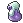

### Gate Key 
Lets the player go through the gate in the Village (2nd world), if the player doesn't have it he's blocked. This item is not usable in duel or in the biome and can't be sold/bought. 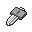

### Swimmer 
Lets the player walk on the water, if the player doesn't have it the game is instantly over. The item is not usable in duel or in the biome but can be sold/bought for 10 coins. 

### X 
Kills the pokemon B in the Boss (3rd world) instantly if used. This item can be used in duel, can't be used in the biome and can't be sold/bought. 

### Over 
Game over instantly. This item can't be used in duel neither can be sold/bought, but can be used in the biome. 

### Tree Key 
Lets the player walk through trees. This item can't be used in duel and in the biome and can't be sold/bought. 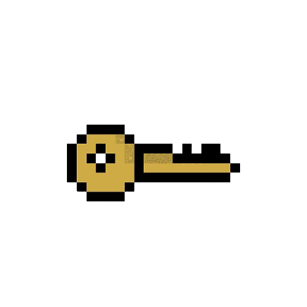

### Bomb 10 
Burn everything except doors/gate/.. in a 3 cases radius around the player. This item can't be used in duel but can be used in the biome and can't be sold/bought. 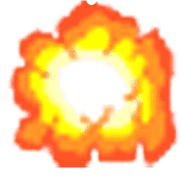

### Teleportation 
When used in the inventory by clicking on it, teleports the player on a case randomly chosen in one of the biome, also chosen randomly. This item can be bought/sell for 60 coins. 

### Malus 50
When used during a duel or in the biom, reduce the attack of the player by 50%. This item can be sold/bought for 60 coins. 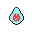

## PNJ
PNJ can "talk" to the player with a dialog. You can interact with them by clicking on F when you are next to them. You can go through them.

### Old Man
This PNJ can only be talked to, you can find different versions of him in all worlds. 

### Merchant
This PNJ is here to buy items from you and sell some. It has a lot of coins and can buy anything from you and sell you his inventory. You can find the merchant in the House (1st world). 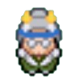

### Thief
This PNJ can steal you. If your inventory is empty the thief onyl says "Have a good day to you", however if you have more than one item in your inventory, the thief steals one item randomly. You can't interact more than that. 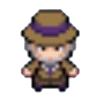
## Pokemon
Pokemon are here to fight with you ! They can be found all around the worlds. To start a fight you must press F when you're next to a Pokemon.

### Pikachu
Pikachu inflicts 10 of damage when it's his turn and has 30 of HP. 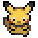 

### Pikachu 2
Pikachu2 inflicts 10 of damage and has a 10 of HP. 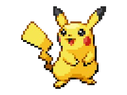

When all Pikachu 2 are killed in all the worlds an item appears at the place of the last Pikachu2 killed. 

### Dracofeu
It's the boss of the game, if you beat him you win. Dracofeu inflicts 15 of damage and has 50 of HP. 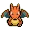

### Slowbro
Slowbro inflicts 10 of damage and has 10 of HP, however this pokemon is always killed with only one attack by the player. If the item X is used against him he instantly dies. 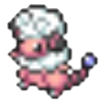